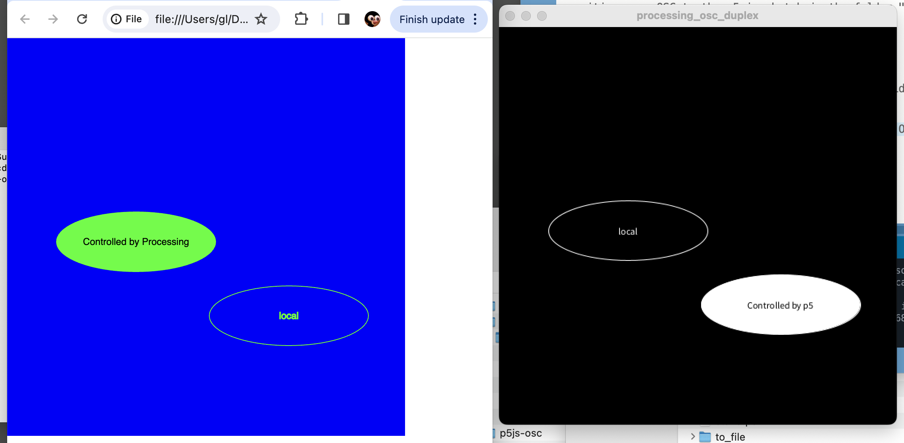

# OSC, p5, Processing, ml5, node

### OSC transmission from p5.js with ml5.js to Processing 4.3 via node 22.3.0

* December 2024 by Golan Levin
* Originally based on `p5js_osc` by Gene Kogan. 
* Tested with node 22.3.0, p5.js 1.11.2, Processing 4.3, ml5.js v.0.12, and socket.io 1.4.5. 

---

## Steps

### 1. Install [node](https://nodejs.org/) if necessary. 

If necessary, install or update node on your system. Instructions are [here](https://nodejs.org/en/download/package-manager). Most likely you would type the following at the Terminal: 

	$ nvm install 22 

### 2. Install required libraries for this project

In Terminal, `cd` to the current directory (`p5js_osc`). Run npm to get required libraries, using the commands below. This will create and populate a directory called `node_modules` inside of `p5js_osc`:

	$ cd p5js_osc/
	$ npm install

### 3. Start the Node server. 

Now we will start node. It is essential to run this "bridge" in order for OSC communications to work: 

    $ node bridge.js
    
### 4. Run the demo

Decide which demo you'd like to run: 

* `demo_1_p5js_osc_duplex` — Full duplex OSC communication between p5 and Processing
* `demo_2_p5js_transmits_osc` — Processing receives mouse data from p5
* `demo_3_p5js_transmits_teachable_osc` — Processing receives Teachable Machine recognition data from p5, using the (older) ml5.js v.0.12.

Launch `index.html` inside your chosen demo directory. This will run the p5.js program (in e.g. the Chrome browser). 

Launch the Processing program in the chosen demo directory, such as `processing_receives_ml5_via_osc.pde`. This will run the Processing program. (Be sure to have installed the OscP5 Processing library beforehand, available from [here](https://sojamo.de/libraries/oscp5/).)

The p5.js and Processing programs will share data over OSC.

